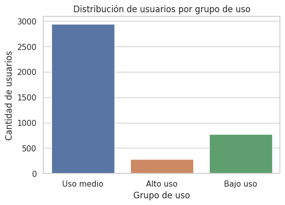
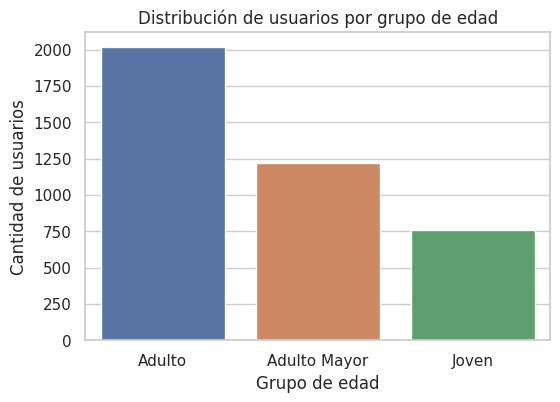
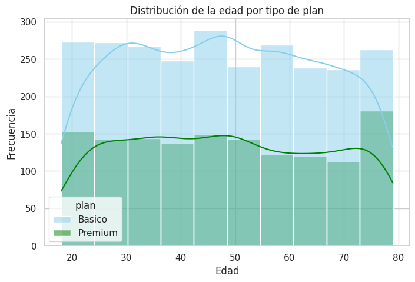
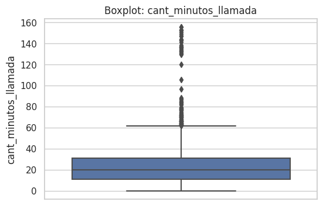

# ConnectaTel — Segmentación y Patrones de Uso

Análisis del comportamiento de clientes de ConnectaTel, una empresa de telecomunicaciones con operación en México y Colombia, usando datos registrados hasta 2024.

## Contexto

ConnectaTel ofrece dos planes (Básico y Premium) y quiere entender cómo sus clientes usan realmente los servicios de llamadas y mensajes para optimizar la oferta comercial y diseñar estrategias de retención.

Se trabajó con tres datasets:
- `plans.csv` — precio, minutos, GB y costos por extra de cada plan
- `users.csv` — edad, ciudad, fecha de registro, plan y churn de cada cliente
- `usage.csv` — detalle de uso real (llamadas y mensajes)

## Preguntas clave

- ¿Qué segmentos de clientes muestran mayor o menor uso?
- ¿Qué usuarios presentan valores atípicos (heavy users)?
- ¿Cómo varía el uso según edad y tipo de plan?

## Metodología

1. **Calidad de datos**: detección y corrección de valores centinela (`-999` en edad) y fechas de registro imposibles (año 2026) — ~5% de la muestra inicial
2. **Análisis de nulos estructurales** en `usage.csv`: los nulos en `duration`/`length` no son errores, sino la segmentación natural entre filas de llamadas y de mensajes
3. **Perfil estadístico** de uso por cliente (mensajes, llamadas, minutos) durante 2024
4. **Detección de outliers** con el método IQR sobre edad, mensajes, llamadas y minutos de llamada
5. **Segmentación de clientes** por grupo de edad y por nivel de uso (Básico dominante vs. Premium subutilizado)
6. **Visualización** de distribuciones, boxplots y segmentos

## Resultados y recomendaciones

- La base de clientes es madura (**mediana de 48 años**), sin brecha digital marcada en consumo de voz/mensajes entre los grupos de 20–40 y 40–70 años
- **65%** de los clientes usa el plan Básico (3–6 llamadas por periodo); el **35%** en Premium muestra un consumo de mensajes (4–7) y llamadas estadísticamente similar al plan Básico → **infrautilización del plan Premium**
- Se identificaron *heavy users* con más de 120 minutos de consumo (~20x el promedio), candidatos a monitoreo por posible uso comercial/reventa o a programas de lealtad
- Recomendación: diferenciar el plan Premium con beneficios no ligados a minutos/SMS (redes sociales ilimitadas, roaming México-Colombia) para evitar que los clientes perciban sobrecobro y migren al plan Básico
- El **7.6% de churn** debe analizarse en relación con los usuarios intensivos del plan Básico afectados por costos adicionales
- Se recomienda implementar reglas de validación en la captura de datos (edades negativas, años futuros) para mantener integridad de datos superior al 99%

## Visualizaciones

| | |
|---|---|
|  |  |
|  |  |

Gráficas adicionales (histogramas y boxplots individuales) disponibles en la carpeta [`images/`](images/).

## Herramientas

Python (pandas, seaborn, matplotlib) en Jupyter Notebook.

## Estructura del repo

```
connectatel-usage-segmentation/
├── ConnectaTel.ipynb
├── images/
└── README.md
```
